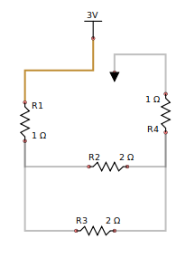

# sim16f
A PIC16f628 simulator

# Why another PIC simulator?

If you are looking for a complete and fully functional PIC simulator, which fully implements a variety of PIC chip models, and even the Ardiuno, look no further than [PICSim and PicSimLab](https://sourceforge.net/projects/picsim/#:~:text=PICSimLab%20is%20a%20realtime%20emulator%20of%20development%20boards,MPLABX%2Favr%2Dgdb%20debugger.&text=PICSimLab%20have%20integration%20with%20MPLABX,to%20the%20boards%20for%20simulation).

The goals of this project are quite different.  The intention is to build a tool that very specifically simulates the PIC16f6xx chips, notably the PIC16F627 and PIC16F628, provides an assembler and disassembler, allows single step execution through code, direct editing of RAM, Flash or EEPROM and lets one explore fully how the PIC16f6xx chips interact with on-chip devices.  Part of this is reading or writing files in the INTEL Hex format, which is generally used to program these chips.

While this is admittedly an ambitious project, the reward is personal.  It has been over a decade since I have had an opportunity to play with C++ again, and this allows me to explore the numerous changes to the C++ specification.   My tinkering with microcontrollers in circuit design will also directly benefit from this project.

# How does this project add to what PicSim already provides?

Where PicSim is a "*real time*" simulator, sim16f makes no pretense of being that.  In fact, "*real time*" is way to fast for what sim16f aims to accomplish.  Rather than trying for device implementations which can execute close to or at the 1-5Mhz range, there may be some value in a different approach. 

When reading a data sheet, the PIC16f document shows a variety of block diagrams describing the design of various components in the chip.  One day, while I was re-reading one of those block diagrams, I though to myself: "I wonder what it would be like if those diagrams were live?", and that was the start of sim16f.

Sim16f animates several of the block digrams found in the PIC16f data sheet, and can show how signals between the components of the chip are affected by a running program.  I find that this helps to trace behaviour rather closely, although absolute accuracy is of course, impossible.

A really fun one was the TMR0 implementation.  Particularly the way the clock and prescaler work together to determine the timer value, as well as triggering the T0IF interrupt flag.  To demonstrate the signal timeing, a small scope component was built.

Not all sim16f tools are animated graphical block diagrams;  sim16f also provides editors for eeprom & flash, and pages for exploring register values as they change during program execution.

Common to all app displays, is the assembler listing of the flash content.  This is produced by disassembling the flash, and then displaying each instruction in turn.  At the same time, a program trace is produced to STDOUT.  The trace is quite useful as it shows a full history of program execution.

The program includes a HEX file loader, as well as quite a nice assembler.  For example, the following assembler code is meant to test TMR0 function, including a TMR0 interrupt handler (see timer0.a).

		;__________________________________________________________________________________________
		;  This program exercises the TMR0 interrupt
		;  ===========================================
		
		w-save:			EQU 0x7f          ; where we save the W register during interrupts
		sts-save: 		EQU 0x22          ; where we save the STATUS register during interrupts
		direction:		EQU 0x26          ; increments or decrements PORTA depending on direction
		tmr0-initval:	EQU 0xE1          ; value to use when initialising TMR0
		
				CONFIG	0x3f71        		; set configuration
		;______________________________________________________________________
		;  Program starts here
		program-start:	
				ORG 0             		; Code starts at PC=0
				call	initialise    		; Call the initialise procedure
				goto    start         	; Start adding 'direction' to PORTB
		
		;______________________________________________________________________
		;  After TMR0 overflows, we come here, with GIE disabled
		isr-save:
				ORG 4                 ; this is the start of the interrupt vector.
				movwf	w-save            ; save W register
				swapf	STATUS,w          ; swap high & low nibbles of status, store in W
				clrf	STATUS            ; Clear status register
				movwf	sts-save          ; save W to sts-save
		irq-handler:
				btfss	INTCON,T0IF       ; Was TMR0 the interrupt source?
				goto	exit-irq          ;  if not, exit the IRQ
				bcf	INTCON,T0IF	  		; Clear TMR0 interrupt flag
				movf	direction,w	  	; move direction into W
				sublw	0x00              ; W = 0 - W
				movwf	direction         ; save W to  direction
				movlw	tmr0-initval      ; W = tmr0-initval
				movwf	TMR0              ; Store W to TMR0
		exit-irq:
				swapf	sts-save,w        ; Swap nibbles in sts-save, store in W
				movwf	STATUS            ; Restore status from W
				swapf	w-save,f          ; Swap nibbles in w-save, store in w-save
				swapf	w-save,w          ; Swap nibbles in w-save, store in W
				retfie
		
		;______________________________________________________________________
		;  This is the initialisation routine
		initialise:
				clrf	PORTA      ; Clear PORTA
				clrf	PORTB             ; and PORTB
				bsf	STATUS,RP0        	; Select Bank 1
				clrf	TRISA             ; Clear TRISA
				clrf	TRISB             ; and TRISB, setting ports for output
				clrf	OPTION            ; Clear OPTION (and thus T0CS is low)
				bsf	OPTION,PSA        	; Set PSA high
				bcf	STATUS,RP0        	; Select bank 0
				movlw	0x01              ; W = 1
				movwf	direction         ; Store W to direction
				movlw	tmr0-initval      ; W = tmr1-initval (0xE1)
				movwf	TMR0              ; Store W to TMR0
				bsf	INTCON,T0IE       	; Enable TMR0 Interrupts
				bcf	INTCON,T0IF       	; Clear the TMR0 interrupt flag
				bsf	INTCON,GIE       		; Enable interrupts globally
				return
		
		;______________________________________________________________________
		;  Add direction to portB and loop
		start:	movf	direction,w       ; W = direction
				addwf	PORTB,f           ; PORTB = PORTB + direction
				goto	start             ; and do that again

Of course, there is nothing wrong with using the Microchip assembler or C compiler [built into MPLAB](https://www.microchip.com/en-us/tools-resources/develop/mplab-x-ide "Microchip MPLAB") instead (or even something like [PicForth](https://rfc1149.net/devel/picforth.html "A Forth Compiler"), which I have found extraordinarily useful) to produce your code, but having a built-in assembler is convenient.

# Why the PIC16f6xx series?

No particular reason, other than that these are in my opinion small miracles of technology.  Also, the PIC16f series, being comparatively simple, is a good starting point to build from.

In an 18 pin DIP package, these chips implement an inbuilt 4MHz oscillator (1MHz clock) with the option of a (up to) 20MHz external oscillator, two analog comparators, a voltage reference, two bidirectional 8 bit ports, one CCP module, two analog comparators, three timers with interrupt support, up to 256 bytes of EEPROM, up to 4K programmable flash memory, advanced functions such as low voltage in circuit programming and brown out reset, and a built in serial USART.  The CCP module can easily be made to drive a PWM interface, amongst other uses.

Clearly, not all of these functions are available at once, and one would need to make some choices- for example, the CCP uses pin 3 of port b, but these chips are amazingly versatile, cheap and carry a huge punch when designing any microcontroller based circuit.  Why not the Arduino?  Mainly cost and footprint.  One does not need a 5 pound hammer to drive a thumb tack. If your circuit must have a very low power consumption and does not need a large software component, with a little initiative a small PIC microcontroller is more than adequate for many tasks.

# Requirements

The GUI part of the program is based upon GTK3, and in particular GTKMM 3.  At this time, GTKMM 4 is already available, and at some stage, when more Linux distros support that out of the box, the project may be ported to use the later version.  For now though, we are sticking to GTKMM 3.

Apart from that, the code requires at least C++ 11, but as time progresses, we are not ruling out the use of features from later C++ standards.

Apologies if you find that the code does not always adhere to many accepted coding conventions.  For example, many attribute names do not have an m_ prefix.  This is simply personal preference, and since this is a personal project I feel no particular obligation to adhere to someone else's conventions :-)

# Building and installation

The source comes with a Makefile which should work.  Most of the time.  Once the source settles down, and if there is external interest in the project we will make sure that the Makefile always works!

# News

## Scratchpad is coming along!

The scratchpad is an area where one can define some rudimentary peripheral circuitry, such as switches, LED's and so forth.  This enables interaction & feedback to the PIC to be defined, enough to test PIC programs which expect to read signals from various ports.

[]

An example may be found in /docs/scratchpad.ogg which uses the output from the CLKOUT pin to drive a counter

## Mesh analysis replaces the old manual circuit analysis for analog components

This change will add more flexibility to the scratch pad, although no claim as to accuracy or complete dependability is made here!

Consider the following circuit:

We can see that the circuit contains two "meshes", or sub-circuits, with one resistor, R2 in common.

This circuit may be evaluated to produce the following arrangement.  

    Mesh a:
      Items: 3V R1 R2 R4 GND
      Shared: None
    Mesh b:
      Items: R3 R2
      Shared: R2

Even though R2 is common to both meshes, we only record it in the "shared" component list in the second mesh.

From this, we produce two matrices M, and V containing resistance and voltage equations.

    M is                             V is 
     ┌─────────┬─────────┐            ┌─────────┐
     │      4  ┊     -2  │            │      3  │             :   4a - 2b = 3
     ├┄┄┄┄┄┄┄┄┄┼┄┄┄┄┄┄┄┄┄┤            ├┄┄┄┄┄┄┄┄┄┤
     │     -2  ┊      4  │            │      0  │             :  -2a + 4b = 0
     └─────────┴─────────┘            └─────────┘
        (a)       (b)

D is 12,  where D is the determinant for matrix M.  By replacing columns (a) and (b) respectively with the voltages, and
then finding the determinant, we can calculate Da and Db.  The current (a) for mesh a then becomes Da/D, and the current 
for mesh b becomes Db/D.

    matrix a:                                matrix b:
     ┌─────────┬─────────┐                    ┌─────────┬─────────┐
     │      3  ┊     -2  │                    │      4  ┊      3  │
     ├┄┄┄┄┄┄┄┄┄┼┄┄┄┄┄┄┄┄┄┤                    ├┄┄┄┄┄┄┄┄┄┼┄┄┄┄┄┄┄┄┄┤
     │      0  ┊      4  │                    │     -2  ┊      0  │
     └─────────┴─────────┘                    └─────────┴─────────┘
    Da is 12, Ia is Da/D = 12/12 = 1         Db is 6, Ib is Db/D = 6/12 = 0.5
    
    Replacing in the original equations, we see:
         4a - 2b = 3                  and     -2a + 4b = 0
         4(1) - 2(0.5) = 3                    -2(1) + 4(0.5) = 0
         4    - 1      = 3                    -2    + 2      = 0

From here, we simply subtract the current for shared components from the initial current.  So for R2, the current becomes 1A - 0.5A = 0.5A.  R3 is not shared, and has the current for mesh(b) (0.5A).  The rest of the nodes in mesh a have a current of 1A.
 

