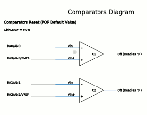

## Using PicForth to generate code for the PIC micro

The following is an example of FORTH code used to generate a program which 
cycles through all comparator modes.  This was used to check all of the variations
for the comparator diagram.

FORTH is quite readable when you get used to it.  It's a little like reading English:

>  Variable comp-mode,
>  main, start, zero comp-mode store, begin
>  comp-mode fetch, 7 and, dup, 1 comp-mode plus-store, cmcon fetch F8 and, or, cmcon store, 
>  again...

	    forth> warnings off
	    pic16f628
	    forth> warnings on

	    variable comp-mode

	    ( cycles through all comparator modes )
	    main : start 
	      0 comp-mode !               ( start with comparator mode 0 )
	      begin
		    comp-mode @ 7 and dup   ( modes use just 3 bits )
	    	    1 comp-mode +!          ( increment and store for next iteration )
		    cmcon @ $F8 and         ( fetch cmcon, strip lower 3 bits )
		    or cmcon !              ( add the mode from result and store )
	      again
	    ;

	    false set-wdte          \ Do not use watchdog timer
	    fosc-intrc-clk set-fosc \ Internal oscillator
	    false set-lvp           \ No low-voltage programming
	    true set-boden          \ No brown-out reset

Compiling this generates the following PIC code.  I have annotated the listing with the FORTH equivalent:

	0000:   CLRF    PCLATH          ; Clear f
	0001:   GOTO    0x4             ; Go to address (init-picforth)
	0002:   NOP                     ; No Operation
	0003:   NOP                     ; No Operation
	0004:   MOVLW   0x33            ; Move literal to W
	0005:   MOVWF   FSR             ; Move W to f
	0006:   CLRF    0x22            ; Clear f                 ; 0 comp-mode !
	0007:   MOVF    0x22,w          ; Move f                  ; comp-mode @
	0008:   ANDLW   0x7             ; AND literal with W      ; 7 and
	0009:   DECF    FSR,f           ; Decrement f             ; dup
	000a:   MOVWF   INDF            ; Move W to f             ; ( dup pushes to stack )
	000b:   ADDLW   0x1             ; Add literal and W       ; 1 comp-mode
	000c:   MOVWF   0x22            ; Move W to f             ; +!
	000d:   MOVF    CMCON,w         ; Move f                  ; cmcon @
	000e:   ANDLW   0xF8            ; AND literal with W      ; F8 and
	000f:   IORWF   INDF,w          ; Inclusive OR W with f   ; or
	0010:   INCF    FSR,f           ; Increment f             ; ( pop from stack)
	0011:   MOVWF   CMCON           ; Move W to f             ; cmcon !
	0012:   GOTO    0x7             ; Go to address           ; again

