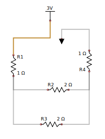

## Mesh analysis replaces the old manual circuit analysis for analog components

This change will add more flexibility to the scratch pad, although no claim as to accuracy or complete dependability is made here!

Consider the following circuit:

We can see that the circuit contains two "meshes", or sub-circuits, with one resistor, R2 in common.

This circuit may be evaluated to produce the following arrangement.  

    Mesh a:
      Items: 3V R1 R2 R4 GND
      Shared: None
    Mesh b:
      Items: R3 R2
      Shared: R2

Even though R2 is common to both meshes, we only record it in the "shared" component list in the second mesh.

From this, we produce two matrices M, and V containing resistance and voltage equations.

    M is                             V is 
     ┌─────────┬─────────┐            ┌─────────┐
     │      4  ┊     -2  │            │      3  │             :   4a - 2b = 3
     ├┄┄┄┄┄┄┄┄┄┼┄┄┄┄┄┄┄┄┄┤            ├┄┄┄┄┄┄┄┄┄┤
     │     -2  ┊      4  │            │      0  │             :  -2a + 4b = 0
     └─────────┴─────────┘            └─────────┘
        (a)       (b)

D is 12,  where D is the determinant for matrix M.  By replacing columns (a) and (b) respectively with the voltages, and
then finding the determinant, we can calculate Da and Db.  The current (a) for mesh a then becomes Da/D, and the current 
for mesh b becomes Db/D.

    matrix a:                                matrix b:
     ┌─────────┬─────────┐                    ┌─────────┬─────────┐
     │      3  ┊     -2  │                    │      4  ┊      3  │
     ├┄┄┄┄┄┄┄┄┄┼┄┄┄┄┄┄┄┄┄┤                    ├┄┄┄┄┄┄┄┄┄┼┄┄┄┄┄┄┄┄┄┤
     │      0  ┊      4  │                    │     -2  ┊      0  │
     └─────────┴─────────┘                    └─────────┴─────────┘
    Da is 12, Ia is Da/D = 12/12 = 1         Db is 6, Ib is Db/D = 6/12 = 0.5
    
    Replacing in the original equations, we see:
         4a - 2b = 3                  and     -2a + 4b = 0
         4(1) - 2(0.5) = 3                    -2(1) + 4(0.5) = 0
         4    - 1      = 3                    -2    + 2      = 0

From here, we simply subtract the current for shared components from the initial current.  So for R2, the current becomes 1A - 0.5A = 0.5A.  R3 is not shared, and has the current for mesh(b) (0.5A).  The rest of the nodes in mesh a have a current of 1A.
 

