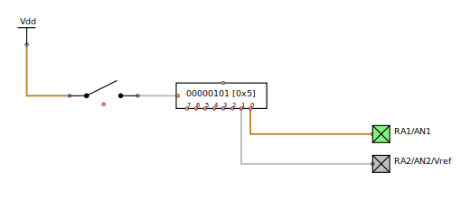
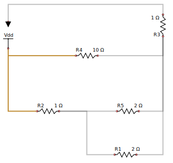
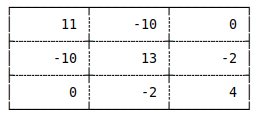

## Scratch pad is coming along!

The scratchpad is an area where one can define some rudimentary peripheral circuitry, such as switches, LED's and so forth.  This enables interaction & feedback to the PIC to be defined, enough to test PIC programs which expect to read signals from various ports.

[Scratchpad Demo](scratchpad.mp4)

An example may be found in /docs/scratchpad.ogg which uses the output from the CLKOUT pin to drive a counter

## Scratch pad now has load & save.

We can now load & save scratch pad data, which means one no longer need build the circuit from scratch (pun not intended) each time. Data is saved to XML, and includes attributes such as resistances & voltages.

The implementation is a little incomplete, and does not as yet save all attributes.

The scratch pad solves simple circuits consisting or one or two meshes with reasonable reliability, for example:

3-mesh circuits seem ok for now, although 4 mesh circuits and higher sometimes have difficulties.  The following 3-mesh circuit was used for testing, and it consistently produces a correct solution matrix:

 
